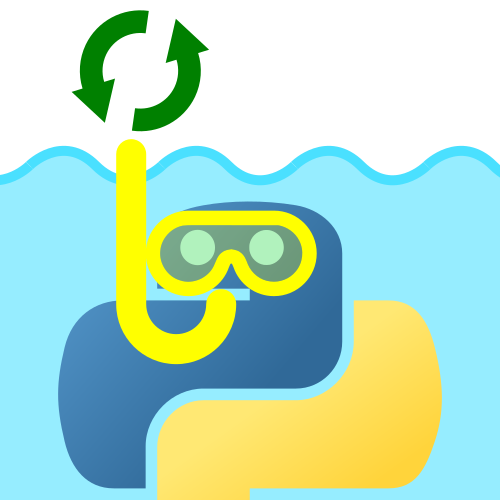

# Plongée au cœur de l'asynchrone en Python

_Sans boire la tasse._

## Lecture

Le tutoriel est publié sur Zeste de Savoir à l'adresse suivante : <https://zestedesavoir.com/articles/3306/plongee-au-coeur-de-lasynchrone-en-python/>.

Ou directement consultable depuis Github en parcourant le dossier [`src/`](src/).

Présentation associée au cours : <https://github.com/entwanne/presentation_python_plongee_asynchrone>.

## Compilation

Le *Makefile* présente des règles de compilation vers deux formats :

* *PDF* : `make plongee_asynchrone.pdf` (nécessite *pandoc* et *latex*) ;
* Archive *ZIP* *Zeste de savoir* : `make plongee_asynchrone.zip` (nécessite *python*).

## Licence

Article sous licence [CC BY-SA](https://creativecommons.org/licenses/by-sa/4.0/deed.fr).
